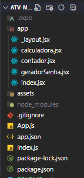

# 🧩 Atividade Prática de Mobile – App com Navegação Drawer – Expo Router

Este projeto foi desenvolvido como parte de uma atividade prática, com o objetivo de criar um aplicativo móvel multifuncional utilizando **React Native com Expo** e **Expo Router**, com navegação via **Drawer (menu lateral)**. O app conta com três funcionalidades principais: uma página de Calculadora Simples, um Contador e um Gerador de Senha Aleatória.  

## 📱 Contexto

Você foi contratado por uma empresa de tecnologia que está desenvolvendo um aplicativo multifuncional simples, com foco em produtividade e utilitários. Sua missão foi criar uma aplicação mobile utilizando **React Native com Expo**, organizando a navegação entre as telas com **Drawer (menu lateral)**, utilizando o **Expo Router**.

---

## 🎯 Funcionalidades

**1. 🔢 Calculadora Simples**  
   Permite realizar operações básicas entre dois números:  
    - ➕ Adição (+)
    - ➖ Subtração (-)
    - ✖️ Multiplicação (×)
    - ➗ Divisão (÷)

**2. ⏱️ Contador**  
   - Botão para incrementar um número  
   - Botão para zerar o contador  

**3. 🔐 Gerador de Senha Aleatória**  
   - Gera senhas aleatórias contendo letras, números e símbolos  

---

## 🛠️ Tecnologias Utilizadas

- **React Native**
- **Expo Router**
- **Expo**
- **Navegação Drawer (menu lateral)**

---

## 🛠 Requisitos Técnicos
- O projeto foi criado com o comando:
  ```bash
  npx create-expo-app@latest meu-app --template blank
  ```
---

## 📂 Estrutura de Pastas


---

## 📸 Demonstração
[](https://youtu.be/GhJqPwWQ4uU?si=XgJacnxLAWWBOwtX)

---

## 🚀 Como Executar o Projeto

**1. Clone o repositório e navegue até o diretório do projeto::**
```bash
git clone https://github.com/seu-usuario/nome-do-repositorio.git
cd nome-do-repositorio
```

**2. Instale as dependências:**
```bash
npm install
```
**3. Rode o projeto:**
```bash
npx expo start
```

---

## 👩‍💻 Autoria e Informações
- Maria Eduarda Reis Pereira
- SENAI - Curso Desenvolvimento de Sistema
- Atividade Pratica de Mobile